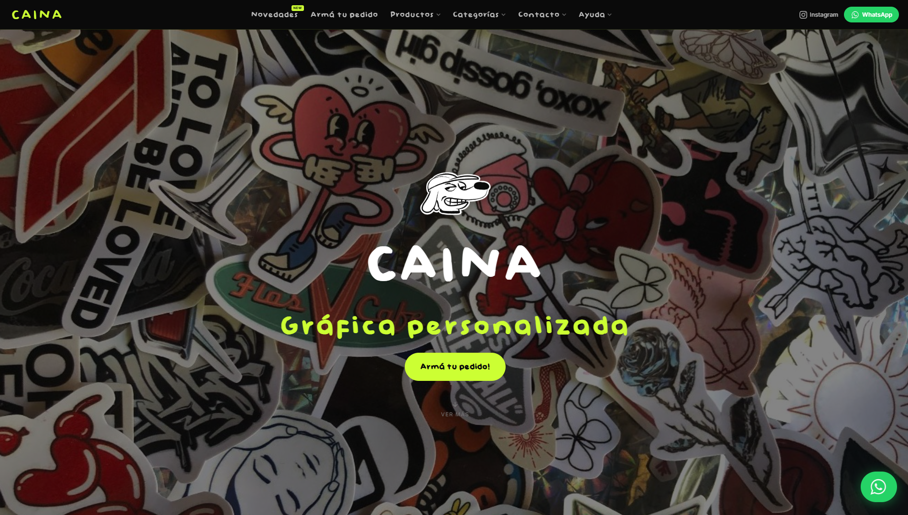
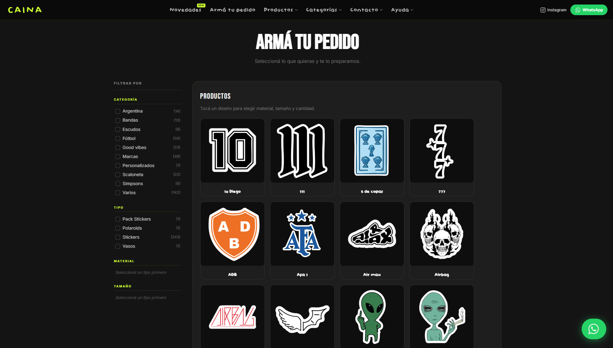
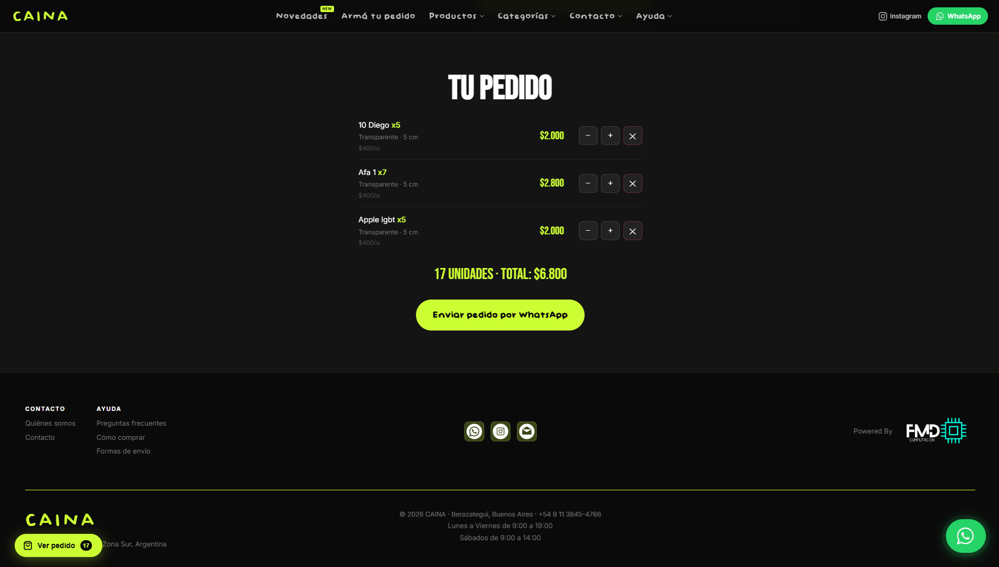
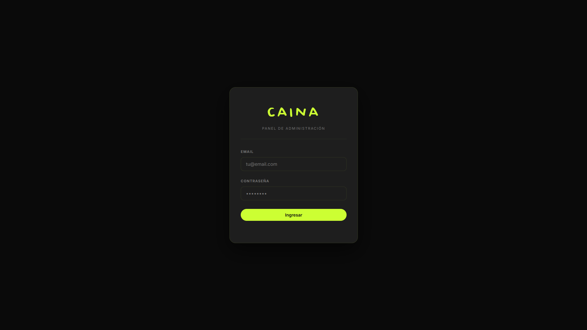
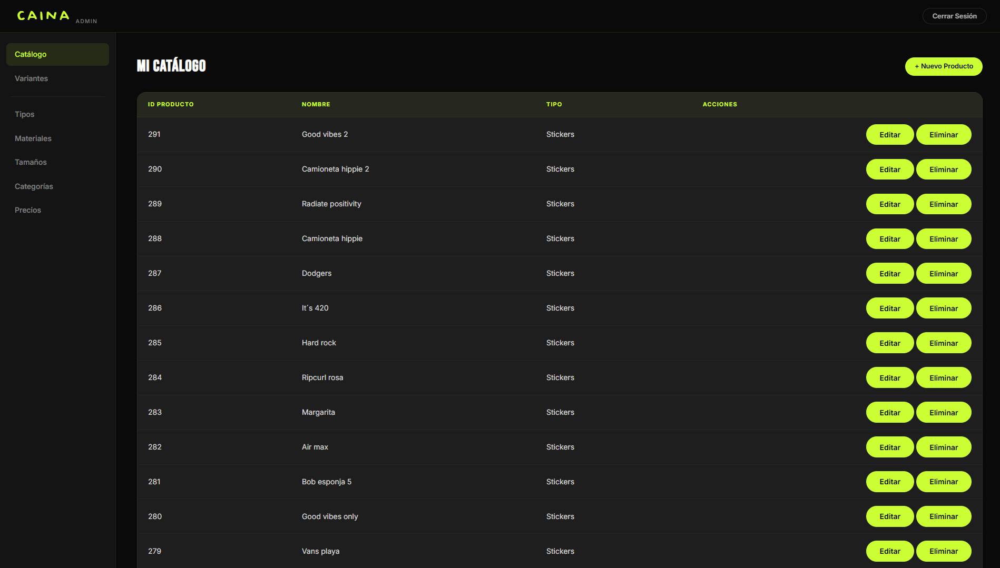

# CAINA — E-commerce y Sistema de Gestión para Gráfica Personalizada

**E-commerce de productos personalizados para una imprenta gráfica de Berazategui, Buenos Aires.**

Sitio web completo con vitrina pública dinámica, carrito de compras y panel de administración privado para gestión de inventario, variantes y precios. Stack 100% vanilla + Supabase — sin frameworks, sin proceso de build, desplegado en Netlify.

---

**Demo:** https://cainaweb.netlify.app/

---

## Capturas

### Inicio



### Catálogo público



### Carrito de compras



### Log In



### Panel administrativo



---

## Características principales

### Vitrina pública

- **Catálogo dinámico** con carga paginada (20 productos por página con _Load More_)
- **Filtros en sidebar** por categoría, tipo de producto, material y tamaño — combinables y en cascada
- **Carrito de compras** persistido en `localStorage` con cálculo de precios en tiempo real
- **Envío de pedidos por WhatsApp** — el carrito se formatea automáticamente como mensaje con detalle y total
- **Sección Novedades** — productos destacados con carga independiente
- **Galería estilo Instagram** con imágenes de muestra
- **Diseño mobile-first** — navegación responsive, sidebar colapsable en móvil, botón flotante de carrito

### Panel de administración

- **Autenticación segura** con Supabase Auth (email/contraseña, sesión persistente, auto-logout por inactividad)
- **CRUD de productos** con:
  - Subida y conversión de imágenes a WebP (máx. 1400px) en el cliente
  - Reordenamiento de imágenes por drag & drop
  - Generación automática de variantes al guardar (material × tamaño)
- **Gestión de variantes en bulk** — edición masiva de stock y precios por combinación con paginación lazy
- **Gestión de catálogo completa**: Tipos, Materiales, Tamaños, Categorías y Precios

---

## Stack tecnológico

| Capa | Tecnología |
|---|---|
| Frontend | HTML5, CSS3, JavaScript (Vanilla ES6+) |
| Base de datos | Supabase (PostgreSQL) |
| Autenticación | Supabase Auth |
| Almacenamiento | Supabase Storage (bucket `productos`) |
| Deploy | Netlify (static hosting) |
| Fuentes | Bebas Neue, Inter, Baby Doll (custom) |

> **Decisión técnica:** Se eligió stack vanilla sin npm para eliminar dependencias de build, facilitar el mantenimiento a futuro y mantener tiempos de carga mínimos sin bundler.

---

## Arquitectura del proyecto

```
caina-web/
├── index.html                   # Landing page con hero, novedades, galería y CTA
├── pedido.html                  # Catálogo completo con carrito
├── novedades.html               # Grid de productos destacados
├── contacto.html                # WhatsApp · Instagram · Email
├── nosotros.html                # Historia de la marca
├── faq.html                     # Preguntas frecuentes
├── como-comprar.html            # Guía de compra
├── envio.html                   # Información de envíos
│
├── js/                          # Lógica del sitio público
│   ├── catalogo.js              # Carga y renderizado de productos
│   ├── filtros.js               # Sidebar filters (multi-select, cascada)
│   ├── carrito.js               # Carrito con localStorage + generador de mensaje WA
│   ├── nav.js                   # Navegación dinámica
│   └── config.js                # Credenciales Supabase (anon key)
│
├── admin/                       # Panel de administración (ruta protegida)
│   ├── login.html               # Autenticación
│   ├── panel.html               # Dashboard principal
│   ├── form-producto.html       # ABM de productos con imágenes
│   ├── variantes.html           # Editor masivo de variantes
│   └── js/
│       ├── auth.js              # Gestión de sesión + auto-logout
│       ├── form-producto.js     # Upload, WebP, reordenamiento, variantes automáticas
│       ├── variantes.js         # Paginación de variantes (1000+ registros)
│       └── modules/             # CRUD independiente por entidad
│           ├── products.js
│           ├── materials.js
│           ├── sizes.js
│           ├── categories.js
│           ├── types.js
│           └── prices.js
│
├── css/                         # Estilos modulares por sección
└── assets/                      # Imágenes, íconos y fuentes estáticas
```

---

## Modelo de datos (Supabase / PostgreSQL)

### Tablas

| Tabla | Atributos principales | Descripción |
|---|---|---|
| `producto` | id_producto, nombre, descripcion | Entidad principal del catálogo |
| `tipo` | id_tipo, nombre_tipo | Tipo de producto (sticker, vinilo, tatuaje, etc.) |
| `material` | id_material, nombre_material | Material disponible (papel, vinilo UV, etc.) |
| `tamanio` | id_tamanio, valor, unidad | Tamaño disponible (ej: 10 cm, A4) |
| `variante` | id_variante, stock | Combinación única de producto + material + tamaño |
| `categoria` | id_categoria, nombre_categoria | Clasificación temática del producto |
| `imagen_producto` | id_imagen, id_producto, path_imagen, orden | Imágenes asociadas a un producto con orden |
| `precio` | id_precio, valor | Regla de precio base |
| `tipo_material` | — | Materiales habilitados por tipo de producto |
| `tipo_tamanio` | — | Tamaños habilitados por tipo de producto |
| `precio_usa_tipo` | — | Precio base por tipo de producto |
| `precio_usa_material` | — | Modificador de precio por material |
| `precio_usa_tamanio` | — | Modificador de precio por tamaño |
| `producto_pertenece_categoria` | — | Relación N:M producto ↔ categoría |

**Sistema de precios:** cada `precio` puede asociarse a un tipo de producto (`precio_usa_tipo`), con modificadores opcionales por material (`precio_usa_material`) y tamaño (`precio_usa_tamanio`). Esto permite definir precios base por tipo y ajustarlos según la variante seleccionada.

**Control de variantes disponibles:** `tipo_material` y `tipo_tamanio` definen qué materiales y tamaños son válidos para cada tipo, restringiendo las combinaciones que el admin puede crear y los filtros que ve el cliente.

---

## Flujo de compra

```
1. Cliente navega el catálogo → filtra por tipo / material / tamaño
2. Selecciona variante → agrega al carrito
3. El carrito persiste entre navegaciones (localStorage)
4. "Enviar pedido" → genera mensaje WhatsApp con:
      - Listado de productos, variantes y cantidades
      - Precio por ítem y total final
5. El cliente envía el mensaje al número de CAINA para coordinar el pedido
```

---

## Funcionalidades técnicas destacadas

**Filtros en cascada:** seleccionar un tipo de producto limita dinámicamente los materiales y tamaños disponibles para ese tipo, evitando combinaciones inválidas sin recargar la página.

**Paginación de variantes en admin:** el panel puede manejar más de 1.000 variantes con carga lazy, evitando queries pesadas y manteniendo la UI fluida.

**Conversión de imágenes en el cliente:** las imágenes se convierten a WebP y se redimensionan a 1.400px de ancho directamente en el browser antes de subirse a Supabase Storage — sin infraestructura de procesamiento en servidor.

**Auto-generación de variantes:** al guardar un producto, el sistema genera automáticamente todas las combinaciones (material × tamaño) habilitadas para su tipo, eliminando carga manual.

**Skeleton loading:** estados de carga con placeholders animados en catálogo y novedades para mejorar la percepción de velocidad.

**Protección de rutas admin:** toda navegación dentro del panel verifica sesión activa en Supabase Auth y redirige al login si expiró, con auto-logout por inactividad configurable.

---

## Design system

| Token | Valor |
|---|---|
| Color de fondo | `#0A0A0A` |
| Color de acento | `#ccff33` (chartreuse) |
| Texto principal | `#FFFFFF` |
| Fuente display | Bebas Neue |
| Fuente body | Inter |

Diseño oscuro con acento neon — estética urbana/gráfica acorde al rubro de la marca.

---

## Instalación y configuración local

```bash
# 1. Clonar el repositorio
git clone <repo-url>
cd caina-web

# 2. Configurar credenciales de Supabase
# Editar js/config.js y admin/js/config.js:
const SUPABASE_URL = 'https://tu-proyecto.supabase.co'
const SUPABASE_ANON_KEY = 'tu-anon-key'

# 3. Levantar con cualquier servidor HTTP estático
npx http-server .
# o usar Live Server en VS Code
```

No requiere `npm install` ni build steps — el proyecto corre directamente desde el filesystem o cualquier servidor HTTP estático.

---

## Deploy

Configurado para deploy continuo en **Netlify**:

1. Conectar el repositorio en Netlify
2. Build command: _(ninguno — sitio estático puro)_
3. Publish directory: `/` (raíz del proyecto)
4. Variables de entorno: no requeridas (credenciales en `config.js`)

---

## Estado del proyecto

En producción
Actualmente utilizado para la gestión de productos y consultas de una gráfica personalizada.

---

## Próximas funcionalidades

- Integración con Mercado Pago
- Seguimiento de pedidos
- Panel de clientes
- Gestión de órdenes

---

- ## Autor

Desarrollado por Franco Matias Dogil para una gráfica personalizada de Berazategui, Buenos Aires.

---
